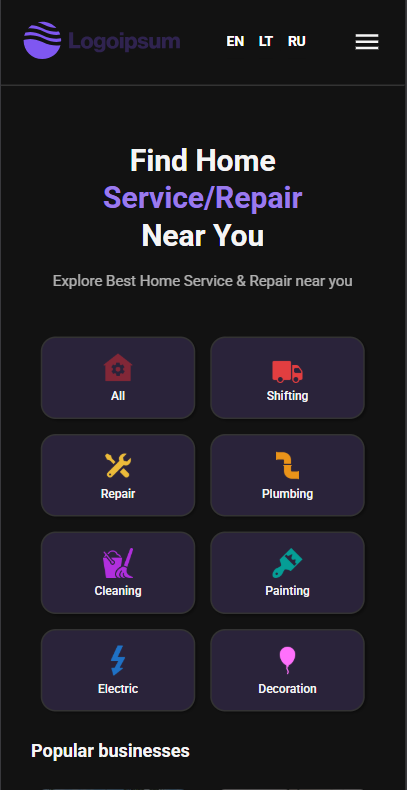

# Home Service full-stack app

A modern platform for booking home services (cleaning, repairs, painting, etc.) with user profiles, email confirmations and multi-language support.

### Features

- **User Accounts**: Register, log in and update your profile information.
- **Service Booking**: Schedule services with professionals.
- **Email Notifications**: Receive booking confirmations and updates.
- **Favorites**: Save preferred services for quick access.
- **Multi-Language**: Switch between languages (English, Lithuanian and Russian).
- **Service Providers**: Register and list your own services.
- **Dark Mode Toggle**: Switch between light and dark themes.

### Links

- Code URL: (https://github.com/agneja00/FEAC)
- Live Site URL: (https://home-services-f898b008a33e.herokuapp.com/en)

### Built with

- React vite
- Typescript
- SASS
- Node JS
- Express JS
- React Testing Library
- Jest
- React Query
- MongoDB
- SendGrid
- Heroku

## Author

- Website - [Agnieska Jackevic] (https://web-portfolio-agneja00.vercel.app/)
- Linkedin - [Agnieska Jackevic] (https://www.linkedin.com/in/agnieska-jackevic-948830222/)

